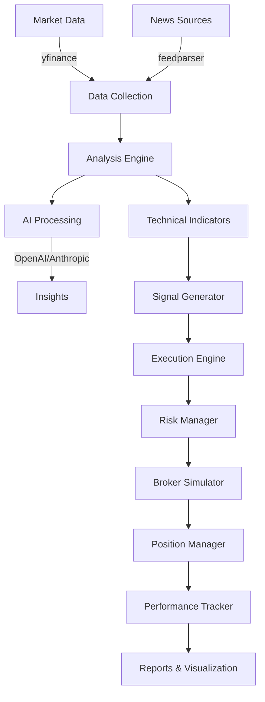

# ZenMarket AI 📊

> **AI-powered financial intelligence and automated market analysis system**

[](https://github.com/TechNatool/zenmarket-ai/actions)
[](https://codecov.io/gh/TechNatool/zenmarket-ai)
[](https://www.python.org/downloads/)
[](https://opensource.org/licenses/MIT)
[](https://github.com/psf/black)
[](https://github.com/astral-sh/ruff)
[](http://mypy-lang.org/)
[](https://github.com/PyCQA/bandit)
[](https://github.com/pre-commit/pre-commit)

ZenMarket AI is a professional-grade financial intelligence system that combines real-time market data, news analysis, sentiment tracking, and AI-powered insights to deliver actionable market intelligence. Built with production-quality code, comprehensive testing, and robust risk management.

---

## ✨ Features

### 📰 Financial Intelligence
- **Automated News Aggregation**: Multi-source financial news fetching
- **AI-Powered Analysis**: OpenAI GPT-4 and Anthropic Claude integration
- **Sentiment Analysis**: Market sentiment tracking with lexicon-based and AI methods
- **Daily Financial Brief**: Comprehensive market overview reports

### 📈 AI Trading Advisor
- **Technical Analysis**: MA20/50, RSI(14), Bollinger Bands, ATR, MACD
- **Trading Signals**: AI-generated BUY/SELL/HOLD signals with confidence scores
- **Visual Charts**: Professional matplotlib charts with indicators
- **Market Bias Detection**: Overall market sentiment analysis

### 💼 Trading Simulator & Backtesting
- **Paper Trading**: Realistic order execution simulator
- **Position Sizing**: Fixed fractional, Kelly criterion, percent of equity, R-multiples
- **Risk Management**: Circuit breakers, position limits, drawdown protection
- **Performance Metrics**: Sharpe, Sortino, CAGR, Max DD, Win rate, Profit factor
- **Backtesting Engine**: Historical simulation with detailed reports

### 🚀 Professional Quality
- **Type Safety**: Full mypy type checking
- **Test Coverage**: ≥90% coverage with unit and integration tests
- **Security**: Bandit security scanning, pip-audit vulnerability checks
- **CI/CD**: Automated testing and quality gates
- **Documentation**: Comprehensive docs with MkDocs
- **Code Quality**: Black, isort, ruff linting

---

## 🚀 Quick Start

### Prerequisites

- Python 3.11 or 3.12
- API keys for:
  - [NewsAPI](https://newsapi.org/) (optional, for news fetching)
  - [OpenAI](https://platform.openai.com/) or [Anthropic](https://www.anthropic.com/) (required for AI features)

### Installation

```bash
# Clone the repository
git clone https://github.com/TechNatool/zenmarket-ai.git
cd zenmarket-ai

# Install dependencies
make setup
# or manually:
pip install -e ".[dev]"

# Copy and configure environment
cp .env.example .env
# Edit .env with your API keys

# Verify installation
make test
```

### Basic Usage

```bash
# Generate financial brief
python -m src.cli brief --symbols AAPL,MSFT,GOOGL

# Run trading simulator
python -m src.cli simulate --symbol AAPL --strategy conservative

# Run backtest
python -m src.cli backtest --symbol AAPL --start 2024-01-01 --end 2024-12-31
```

---

## 📖 Documentation

Full documentation available at: [docs/](docs/)

- [Installation Guide](docs/getting-started/installation.md)
- [Configuration](docs/getting-started/configuration.md)
- [Quick Start](docs/getting-started/quickstart.md)
- [CLI Reference](docs/user-guide/cli.md)
- [Contributing Guide](CONTRIBUTING.md)
- [Security Policy](SECURITY.md)

---

## 🛠️ Development

### Setup Development Environment

```bash
# Install development dependencies
make setup

# Install pre-commit hooks
make install-hooks
```

### Available Make Commands

```bash
make help          # Show all available commands
make fmt           # Format code (black + isort)
make lint          # Lint code (ruff)
make type          # Type check (mypy)
make test          # Run tests
make test-fast     # Run tests in parallel
make cov           # Generate coverage report
make audit         # Security audit (bandit + pip-audit)
make docstrings    # Check docstring coverage
make docs          # Build documentation
make docs-serve    # Serve docs locally
make precommit     # Run all checks (recommended before commit)
make ci            # Run all CI checks
make clean         # Clean build artifacts
```

### Running Quality Checks

```bash
# Format code
make fmt

# Run all checks (recommended before commit)
make precommit

# Individual checks
make lint       # Linting
make type       # Type checking
make test       # Tests
make audit      # Security
```

### Project Structure

```
zenmarket-ai/
├── src/                    # Source code
│   ├── advisor/           # Trading signals and indicators
│   ├── cli/               # Command-line interface
│   ├── core/              # Core analysis engine
│   ├── execution/         # Trading execution and simulation
│   ├── reports/           # Report generation
│   └── utils/             # Utilities
├── tests/                 # Test suite
│   ├── execution/         # Execution module tests
│   └── ...
├── docs/                  # Documentation
├── reports/               # Generated reports
├── data/                  # Data files
├── pyproject.toml         # Project configuration
├── Makefile               # Development commands
├── .pre-commit-config.yaml # Pre-commit hooks
└── README.md              # This file
```

---

## 🧪 Testing

```bash
# Run all tests
make test

# Run with coverage
make cov

# Run unit tests only
make test-unit

# Run integration tests only
make test-integration

# Run fast (parallel)
make test-fast
```

### Test Coverage

Current coverage: ≥90% (lines and branches)

View coverage report:
```bash
make cov
# Open htmlcov/index.html in browser
```

---

## 🔒 Security

ZenMarket AI is designed for educational and research purposes. It operates in **paper trading mode by default**.

### Security Features

- API key protection via `.env`
- Circuit breakers and risk limits
- Input validation with Pydantic
- Regular security audits (bandit, pip-audit)
- Automated dependency updates (Renovate)

### Security Reporting

Please report security vulnerabilities to: security@technatool.com

See [SECURITY.md](SECURITY.md) for details.

---

## 🤝 Contributing

We welcome contributions! Please see our [Contributing Guide](CONTRIBUTING.md) for details.

### Quick Contribution Guide

1. Fork the repository
2. Create a feature branch
3. Make your changes
4. Run quality checks: `make precommit`
5. Commit with conventional commits
6. Submit a pull request

See [CONTRIBUTING.md](CONTRIBUTING.md) for detailed guidelines.

---

## 📊 Performance Metrics

ZenMarket AI tracks comprehensive performance metrics:

- **Returns**: CAGR, Total Return
- **Risk-Adjusted**: Sharpe Ratio, Sortino Ratio, Calmar Ratio
- **Risk**: Maximum Drawdown, Volatility, VaR, CVaR
- **Trading**: Win Rate, Profit Factor, Expectancy, Average Win/Loss
- **Activity**: Number of Trades, Trade Frequency, Holding Period

---

## 🏗️ Architecture



---

## 📝 License

This project is licensed under the MIT License - see the [LICENSE](LICENSE) file for details.

---

## 📧 Contact & Support

- 📧 Email: contact@technatool.com
- 🐛 Issues: [GitHub Issues](https://github.com/TechNatool/zenmarket-ai/issues)
- 💬 Discussions: [GitHub Discussions](https://github.com/TechNatool/zenmarket-ai/discussions)
- 🔒 Security: security@technatool.com

---

## 🙏 Acknowledgments

- Built with OpenAI GPT-4 and Anthropic Claude
- Market data from yfinance
- Technical analysis with pandas and numpy
- Visualization with matplotlib and seaborn

---

## ⚠️ Disclaimer

**This software is for educational and research purposes only. It is not financial advice.**

- Trading involves substantial risk of loss
- Past performance does not guarantee future results
- Paper trading results may not reflect real trading
- Always conduct thorough testing before live trading
- Consult with financial professionals before making investment decisions

Use at your own risk.
