# ZenMarket AI Developer Handbook

**Version:** 1.0.0
**Last Updated:** 2025-01-13
**Audience:** Developers, contributors, maintainers

---

## 📚 Table of Contents

1. [Introduction](#introduction)
2. [Development Environment Setup](#development-environment-setup)
3. [Project Architecture](#project-architecture)
4. [Development Workflow](#development-workflow)
5. [Code Standards & Best Practices](#code-standards--best-practices)
6. [Testing Strategy](#testing-strategy)
7. [CI/CD Pipeline](#cicd-pipeline)
8. [Common Development Tasks](#common-development-tasks)
9. [Troubleshooting](#troubleshooting)
10. [Production Deployment](#production-deployment)
11. [Maintenance & Operations](#maintenance--operations)

---

## Introduction

### Purpose

This handbook serves as the comprehensive guide for developers working on ZenMarket AI. It covers everything from initial setup to production deployment and ongoing maintenance.

### Project Overview

**ZenMarket AI** is a production-ready financial intelligence platform that combines AI technology with sophisticated trading algorithms.

**Key Statistics:**
- **68 Python files** (~8,904 lines of code)
- **378 passing tests** (63.70% coverage)
- **25 documentation files** (8,767 lines)
- **6 core modules** (advisor, execution, backtest, brokers, core, utils)

**Tech Stack:**
- **Language:** Python 3.11+
- **Key Libraries:** pandas, yfinance, openai, anthropic, pytest
- **Code Quality:** Black, isort, ruff, mypy, bandit
- **Documentation:** MkDocs Material with Mermaid diagrams
- **Version Control:** Git with Conventional Commits

---

## Development Environment Setup

### Prerequisites

```bash
# Required
- Python 3.11 or 3.12
- pip 23.0+
- Git 2.40+
- virtualenv or venv

# Recommended
- pyenv (for Python version management)
- direnv (for automatic .env loading)
- pre-commit (for git hooks)
```

### Initial Setup

#### 1. Clone and Navigate

```bash
git clone https://github.com/TechNatool/zenmarket-ai.git
cd zenmarket-ai
```

#### 2. Create Virtual Environment

```bash
# Using venv
python -m venv venv
source venv/bin/activate  # On Windows: venv\Scripts\activate

# Or using pyenv + virtualenv
pyenv virtualenv 3.11.7 zenmarket
pyenv local zenmarket
```

#### 3. Install Dependencies

```bash
# Development installation (includes dev dependencies)
pip install -e ".[dev]"

# Verify installation
python -c "import src; print('✅ Installation successful')"
```

#### 4. Configure Environment

```bash
# Copy example environment file
cp .env.example .env

# Edit .env with your API keys
# Required for full functionality:
# - OPENAI_API_KEY (for AI summarization)
# - ANTHROPIC_API_KEY (for Claude integration)
# - IBKR credentials (if using Interactive Brokers)
# - MT5 credentials (if using MetaTrader 5)
```

#### 5. Install Pre-commit Hooks

```bash
pre-commit install

# Test hooks
pre-commit run --all-files
```

#### 6. Verify Setup

```bash
# Run tests
pytest

# Check code quality
make precommit

# Build documentation (local preview)
mkdocs serve
```

---

## Project Architecture

### Directory Structure

```
zenmarket-ai/
├── src/                    # Source code
│   ├── advisor/           # Trading signals & technical analysis
│   ├── backtest/          # Backtesting engine
│   ├── brokers/           # Broker adapters (IBKR, MT5, Paper)
│   ├── core/              # Core components (data, news, sentiment, AI)
│   ├── execution/         # Order execution & risk management
│   ├── utils/             # Utilities (config, logging, dates)
│   ├── cli.py             # Command-line interface
│   └── main.py            # Main entry point
│
├── tests/                 # Test suite
│   ├── advisor/
│   ├── backtest/
│   ├── execution/
│   └── utils/
│
├── docs/                  # Documentation (MkDocs)
│   ├── index.md
│   ├── architecture.md
│   ├── modules/           # Module documentation
│   ├── user-guide/        # User guides
│   └── trading-logic/     # Trading logic docs
│
├── scripts/               # Utility scripts
│   ├── run_backtest.py
│   └── telegram_sender.py
│
├── context.md             # Project context for Claude Code AI
├── AUDIT_REPORT.md        # Repository audit results
├── CONTRIBUTING.md        # Contribution guidelines
├── pyproject.toml         # Project configuration
├── pytest.ini             # Pytest configuration
├── mkdocs.yml             # Documentation configuration
└── .pre-commit-config.yaml # Pre-commit hooks
```

### Module Dependencies

```
core/
  ├─ market_data.py       # Fetches market data (yfinance)
  ├─ news_fetcher.py      # Aggregates financial news
  ├─ sentiment_analyzer.py # Analyzes sentiment (lexicon + AI)
  ├─ summarizer.py        # AI summarization (OpenAI/Anthropic)
  └─ report_generator.py  # Generates reports (MD, HTML, PDF)

advisor/
  ├─ indicators.py        # Technical indicators (MA, RSI, BB, etc.)
  ├─ signal_generator.py  # Trading signal generation
  ├─ plotter.py           # Chart visualization
  └─ advisor_report.py    # Advisor reports

execution/
  ├─ broker_base.py       # Abstract broker interface
  ├─ broker_simulator.py  # Paper trading simulator
  ├─ execution_engine.py  # Order execution orchestrator
  ├─ position_sizing.py   # Position sizing strategies
  ├─ risk_manager.py      # Risk management checks
  ├─ order_types.py       # Order type definitions
  ├─ pnl_tracker.py       # P&L tracking
  ├─ journal.py           # Trade journaling
  └─ compliance.py        # Compliance checks

backtest/
  ├─ backtest_engine.py   # Backtest orchestrator
  ├─ backtest_broker.py   # Backtest broker simulator
  ├─ metrics.py           # Performance metrics calculation
  └─ visualizer.py        # Result visualization

brokers/
  ├─ broker_factory.py    # Broker factory pattern
  ├─ ibkr_adapter.py      # Interactive Brokers adapter
  └─ mt5_adapter.py       # MetaTrader 5 adapter

utils/
  ├─ config_loader.py     # Configuration management
  ├─ logger.py            # Logging setup
  └─ date_utils.py        # Date utilities
```

---

## Development Workflow

### Branch Strategy

```bash
# Main branches
main              # Production-ready code
develop           # Integration branch (if using GitFlow)

# Feature branches
feature/your-feature-name
fix/bug-description
refactor/component-name
docs/documentation-update
test/test-coverage-improvement
chore/maintenance-task
```

### Standard Workflow

#### 1. Create Feature Branch

```bash
git checkout -b feature/add-new-indicator
```

#### 2. Make Changes

```bash
# Edit files
vim src/advisor/indicators.py

# Add tests
vim tests/advisor/test_indicators.py
```

#### 3. Run Quality Checks

```bash
# Format code
make fmt

# Run all pre-commit checks
make precommit

# Run tests with coverage
make cov
```

#### 4. Commit Changes

Use [Conventional Commits](https://www.conventionalcommits.org/):

```bash
git add .
git commit -m "feat(advisor): add VWAP indicator calculation

- Implement volume-weighted average price
- Add VWAP to default indicator suite
- Include unit tests with 95% coverage
- Update advisor documentation"
```

**Commit Types:**
- `feat`: New feature
- `fix`: Bug fix
- `docs`: Documentation only
- `style`: Code style (formatting)
- `refactor`: Code refactoring
- `perf`: Performance improvement
- `test`: Adding/updating tests
- `chore`: Maintenance
- `ci`: CI/CD changes

#### 5. Push and Create PR

```bash
git push -u origin feature/add-new-indicator

# Create pull request on GitHub
# Use PR template in .github/pull_request_template.md
```

---

## Code Standards & Best Practices

### Python Style Guide

#### Line Length
```python
# Maximum 100 characters per line
# Use Black formatter (automatically enforced)
```

#### Type Hints
```python
# Required for all public functions
from decimal import Decimal
from typing import Optional, List, Dict

def calculate_position_size(
    equity: Decimal,
    risk_percent: float,
    entry_price: Decimal,
    stop_loss: Optional[Decimal] = None
) -> Decimal:
    """Calculate position size based on risk parameters."""
    ...
```

#### Docstrings (Google Style)
```python
def generate_signal(symbol: str, period: str = "6mo") -> TradingSignal:
    """Generate trading signal for a symbol.

    Analyzes technical indicators and market conditions to generate
    a BUY/SELL/HOLD signal with confidence scoring.

    Args:
        symbol: Stock ticker symbol (e.g., 'AAPL').
        period: Historical period for analysis (default: '6mo').

    Returns:
        TradingSignal with signal type, confidence, and reasoning.

    Raises:
        ValueError: If symbol is invalid or data unavailable.
        APIError: If market data fetching fails.

    Example:
        >>> signal = generate_signal("AAPL", "1y")
        >>> print(f"{signal.signal}: {signal.confidence}%")
        BUY: 85%
    """
    ...
```

#### Error Handling
```python
# Use specific exceptions
try:
    data = fetch_market_data(symbol)
except NetworkError as e:
    logger.error(f"Network error fetching {symbol}: {e}")
    raise
except DataError as e:
    logger.warning(f"Data error for {symbol}: {e}, using fallback")
    data = get_cached_data(symbol)

# Never use bare except:
# ❌ except:  # Too broad!
# ✅ except (ValueError, KeyError) as e:  # Specific
```

#### Logging
```python
import logging

logger = logging.getLogger(__name__)

# Structured logging with context
logger.info("Order executed", extra={
    "symbol": symbol,
    "quantity": quantity,
    "price": price,
    "order_id": order_id
})

# Use appropriate levels
logger.debug("Detailed calculation: %s", calculation_details)
logger.info("Trade executed: %s", trade_summary)
logger.warning("Risk limit approaching: %s", limit_details)
logger.error("Execution failed: %s", error_details)
logger.critical("Circuit breaker triggered: %s", reason)
```

#### Constants
```python
# Use UPPER_CASE for constants
MAX_POSITION_SIZE = 0.10  # 10% of portfolio
DEFAULT_RISK_PERCENT = 0.02  # 2% per trade
RSI_OVERSOLD = 30
RSI_OVERBOUGHT = 70
ATR_PERIOD = 14
```

### Code Organization

#### Function Size
```python
# Keep functions under 50 lines
# If longer, extract helper functions

# ❌ Bad: 150-line function
def run_backtest(...):
    # 150 lines of logic

# ✅ Good: Extracted helpers
def run_backtest(...):
    data = load_historical_data(...)
    results = simulate_trading(data, ...)
    metrics = calculate_metrics(results)
    report = generate_report(metrics)
    return report

def load_historical_data(...):
    # 20 lines

def simulate_trading(...):
    # 30 lines

def calculate_metrics(...):
    # 25 lines
```

#### Class Design (SOLID Principles)
```python
# Single Responsibility Principle
# Each class has one clear purpose

class RiskManager:
    """Manages trade risk validation."""
    def check_position_size(self, ...): ...
    def check_daily_loss(self, ...): ...
    def check_drawdown(self, ...): ...

class PositionSizer:
    """Calculates position sizes."""
    def calculate_fixed(self, ...): ...
    def calculate_percent(self, ...): ...
    def calculate_kelly(self, ...): ...

# Don't mix responsibilities
# ❌ class RiskManagerAndPositionSizer:  # Too much!
```

---

## Testing Strategy

### Test Organization

```
tests/
├── conftest.py              # Shared fixtures
├── advisor/
│   ├── test_indicators.py
│   └── test_signal_generator.py
├── backtest/
│   ├── test_backtest_engine.py
│   └── test_metrics.py
├── execution/
│   ├── test_execution_engine.py
│   ├── test_risk_manager.py
│   └── test_position_sizing.py
└── utils/
    └── test_config_loader.py
```

### Test Naming Convention

```python
def test_<component>_<scenario>_<expected_result>():
    """Descriptive test names make failures clear."""
    ...

# Examples
def test_risk_manager_rejects_oversized_position():
    ...

def test_position_sizer_returns_zero_when_risk_is_zero():
    ...

def test_signal_generator_returns_buy_when_rsi_oversold():
    ...
```

### Test Structure (Arrange-Act-Assert)

```python
def test_broker_executes_market_order():
    # Arrange: Set up test conditions
    broker = BrokerSimulator(initial_cash=Decimal('100000'))
    broker.connect()
    order = MarketOrder(symbol="AAPL", quantity=10, side="BUY")

    # Act: Perform the action
    fill = broker.execute_order(order)

    # Assert: Verify expectations
    assert fill.status == OrderStatus.FILLED
    assert fill.quantity == 10
    assert fill.symbol == "AAPL"
    assert broker.cash < Decimal('100000')  # Cash decreased
```

### Fixtures

```python
# tests/conftest.py
import pytest
from decimal import Decimal
from src.execution.broker_simulator import BrokerSimulator

@pytest.fixture
def broker():
    """Provide a clean broker instance for tests."""
    broker = BrokerSimulator(initial_cash=Decimal('100000'))
    broker.connect()
    yield broker
    broker.disconnect()

@pytest.fixture
def sample_market_data():
    """Provide mock market data."""
    return pd.DataFrame({
        'Open': [100, 101, 102],
        'High': [102, 103, 104],
        'Low': [99, 100, 101],
        'Close': [101, 102, 103],
        'Volume': [1000000, 1100000, 1200000]
    }, index=pd.date_range('2024-01-01', periods=3))

# Usage in tests
def test_with_fixtures(broker, sample_market_data):
    # Use fixtures directly
    assert broker.cash == Decimal('100000')
    assert len(sample_market_data) == 3
```

### Mocking External Dependencies

```python
# Mock yfinance to avoid network calls
@pytest.fixture(autouse=True)
def mock_yfinance(monkeypatch):
    """Auto-mock yfinance for all tests."""
    def mock_download(*args, **kwargs):
        return pd.DataFrame({
            'Open': [150.0],
            'High': [151.0],
            'Low': [149.0],
            'Close': [150.5],
            'Volume': [1000000]
        }, index=pd.DatetimeIndex(['2024-01-01']))

    monkeypatch.setattr("yfinance.download", mock_download)

# Mock OpenAI API
@pytest.fixture
def mock_openai(monkeypatch):
    """Mock OpenAI API calls."""
    class MockResponse:
        def __init__(self):
            self.choices = [
                type('obj', (object,), {
                    'message': type('obj', (object,), {
                        'content': 'Mocked AI response'
                    })()
                })()
            ]

    def mock_create(*args, **kwargs):
        return MockResponse()

    monkeypatch.setattr(
        "openai.ChatCompletion.create",
        mock_create
    )
```

### Coverage Requirements

```bash
# Run tests with coverage
pytest --cov=src --cov-report=html --cov-report=term

# Coverage targets
- Overall: ≥70%
- Critical modules (risk, position sizing): ≥95%
- New code: ≥90%
```

### Test Commands

```bash
# All tests
pytest

# Fast (parallel execution)
pytest -n auto

# Specific module
pytest tests/advisor/

# Specific test
pytest tests/advisor/test_signal_generator.py::test_generate_buy_signal

# With coverage
pytest --cov=src --cov-report=html

# Verbose output
pytest -v

# Show print statements
pytest -s

# Stop on first failure
pytest -x

# Run only failed tests from last run
pytest --lf

# Watch mode (re-run on file changes)
ptw
```

---

## CI/CD Pipeline

### Pipeline Overview

```mermaid
flowchart LR
    A[Git Push] --> B[GitHub Actions]
    B --> C[Checkout Code]
    C --> D[Setup Python 3.11]
    D --> E[Install Dependencies]
    E --> F{Code Quality<br/>Checks}

    F --> G[Black Format]
    F --> H[isort Imports]
    F --> I[Ruff Lint]
    F --> J[mypy Types]
    F --> K[Bandit Security]

    G --> L{All Checks<br/>Pass?}
    H --> L
    I --> L
    J --> L
    K --> L

    L -->|No| M[❌ Build Failed]
    L -->|Yes| N[Run Tests]

    N --> O[pytest]
    O --> P{Tests<br/>Pass?}

    P -->|No| M
    P -->|Yes| Q[Coverage Report]

    Q --> R{Coverage<br/>≥60%?}
    R -->|No| S[⚠️ Warning]
    R -->|Yes| T[✅ Build Success]

    S --> U[Notify Team]
    T --> V[Deploy Docs]
    V --> W[Archive Artifacts]

    style A fill:#e1f5ff
    style T fill:#d4edda
    style M fill:#f8d7da
    style S fill:#fff3cd
```



### Workflow File

```yaml
# .github/workflows/ci.yml
name: CI/CD

on:
  push:
    branches: [ main, develop ]
  pull_request:
    branches: [ main ]

jobs:
  test:
    runs-on: ubuntu-latest
    strategy:
      matrix:
        python-version: ["3.11", "3.12"]

    steps:
    - uses: actions/checkout@v3

    - name: Set up Python ${{ matrix.python-version }}
      uses: actions/setup-python@v4
      with:
        python-version: ${{ matrix.python-version }}

    - name: Cache dependencies
      uses: actions/cache@v3
      with:
        path: ~/.cache/pip
        key: ${{ runner.os }}-pip-${{ hashFiles('**/pyproject.toml') }}

    - name: Install dependencies
      run: |
        python -m pip install --upgrade pip
        pip install -e ".[dev]"

    - name: Format check (black)
      run: black --check .

    - name: Import sorting (isort)
      run: isort --check-only .

    - name: Linting (ruff)
      run: ruff check .

    - name: Type checking (mypy)
      run: mypy src/
      continue-on-error: true

    - name: Security scan (bandit)
      run: bandit -r src/

    - name: Run tests
      run: |
        pytest --cov=src --cov-report=xml --cov-report=term

    - name: Upload coverage
      uses: codecov/codecov-action@v3
      with:
        files: ./coverage.xml
        flags: unittests
        name: codecov-umbrella

  docs:
    runs-on: ubuntu-latest
    needs: test

    steps:
    - uses: actions/checkout@v3
    - uses: actions/setup-python@v4
      with:
        python-version: "3.11"

    - name: Install MkDocs
      run: |
        pip install mkdocs-material mkdocs-mermaid2-plugin

    - name: Build docs
      run: mkdocs build

    - name: Archive docs
      uses: actions/upload-artifact@v3
      with:
        name: documentation
        path: site/
```

### Pre-commit Hooks

```yaml
# .pre-commit-config.yaml
repos:
  - repo: https://github.com/pre-commit/pre-commit-hooks
    rev: v4.5.0
    hooks:
      - id: trailing-whitespace
      - id: end-of-file-fixer
      - id: check-yaml
      - id: check-added-large-files
      - id: check-merge-conflict

  - repo: https://github.com/psf/black
    rev: 23.12.1
    hooks:
      - id: black
        language_version: python3.11

  - repo: https://github.com/pycqa/isort
    rev: 5.13.2
    hooks:
      - id: isort
        args: ["--profile", "black"]

  - repo: https://github.com/astral-sh/ruff-pre-commit
    rev: v0.1.11
    hooks:
      - id: ruff
        args: [--fix, --exit-non-zero-on-fix]

  - repo: https://github.com/PyCQA/bandit
    rev: 1.7.6
    hooks:
      - id: bandit
        args: ["-c", "pyproject.toml"]
```

---

## Common Development Tasks

### Adding a New Technical Indicator

```python
# 1. Add to src/advisor/indicators.py
class TechnicalIndicators:
    def calculate_vwap(self, data: pd.DataFrame) -> pd.Series:
        """Calculate Volume-Weighted Average Price."""
        typical_price = (data['High'] + data['Low'] + data['Close']) / 3
        vwap = (typical_price * data['Volume']).cumsum() / data['Volume'].cumsum()
        return vwap

    def calculate_all(self, data: pd.DataFrame) -> pd.DataFrame:
        # ... existing indicators ...
        data['vwap'] = self.calculate_vwap(data)
        return data

# 2. Add tests in tests/advisor/test_indicators.py
def test_vwap_calculation():
    indicators = TechnicalIndicators()
    data = pd.DataFrame({
        'High': [102, 104, 106],
        'Low': [98, 100, 102],
        'Close': [100, 102, 104],
        'Volume': [1000, 1100, 1200]
    })
    result = indicators.calculate_vwap(data)

    assert len(result) == 3
    assert all(result > 0)
    assert result.iloc[-1] > result.iloc[0]  # VWAP trends up

# 3. Update signal generation logic if needed
# 4. Update documentation in docs/modules/advisor.md
# 5. Run tests: pytest tests/advisor/
```

### Adding a New Position Sizing Method

```python
# 1. Add to src/execution/position_sizing.py
class PositionSizer:
    def calculate_volatility_adjusted(
        self,
        equity: Decimal,
        risk_percent: float,
        current_volatility: float,
        avg_volatility: float
    ) -> int:
        """Adjust position size based on current vs average volatility."""
        base_size = self._calculate_percent_risk(equity, risk_percent, ...)

        # Reduce size if volatility is high
        volatility_ratio = avg_volatility / current_volatility
        adjusted_size = int(base_size * volatility_ratio)

        return max(0, adjusted_size)

# 2. Add tests
# 3. Update documentation
# 4. Add to configuration options
```

### Adding a New Broker Adapter

```python
# 1. Create src/brokers/new_broker_adapter.py
from src.execution.broker_base import BrokerBase

class NewBrokerAdapter(BrokerBase):
    def __init__(self, config: Dict):
        super().__init__()
        self.config = config
        self.client = None

    def connect(self) -> bool:
        # Implement connection logic
        pass

    def disconnect(self) -> bool:
        # Implement disconnection logic
        pass

    def place_order(self, order: Order) -> Fill:
        # Implement order placement
        pass

    def get_positions(self) -> List[Position]:
        # Implement position fetching
        pass

# 2. Register in src/brokers/broker_factory.py
class BrokerFactory:
    @staticmethod
    def create_broker(broker_type: str, config: Dict) -> BrokerBase:
        if broker_type == "newbroker":
            return NewBrokerAdapter(config)
        # ... existing brokers ...

# 3. Add comprehensive tests with mocked broker API
# 4. Document in docs/modules/broker.md
```

---

## Troubleshooting

### Common Issues

#### Import Errors

```bash
# Problem: ModuleNotFoundError: No module named 'src'
# Solution: Install in editable mode
pip install -e .

# Or ensure PYTHONPATH includes project root
export PYTHONPATH="${PYTHONPATH}:$(pwd)"
```

#### Test Failures

```bash
# Problem: Tests fail with "No module named 'yfinance'"
# Solution: Install dev dependencies
pip install -e ".[dev]"

# Problem: Tests fail intermittently
# Solution: Check for external dependencies that aren't mocked
pytest -v  # Verbose output to identify culprit
```

#### API Key Issues

```bash
# Problem: OpenAI API errors
# Solution: Check .env file
cat .env | grep OPENAI_API_KEY

# Ensure key is valid
python -c "import os; from dotenv import load_dotenv; load_dotenv(); print(os.getenv('OPENAI_API_KEY'))"
```

#### Pre-commit Hook Failures

```bash
# Problem: Pre-commit hooks fail
# Solution: Run individually to identify issue

black .
isort .
ruff check . --fix
bandit -r src/

# Update hooks
pre-commit autoupdate
```

#### Coverage Too Low

```bash
# Generate HTML coverage report to see what's missing
pytest --cov=src --cov-report=html
open htmlcov/index.html  # macOS
xdg-open htmlcov/index.html  # Linux
start htmlcov/index.html  # Windows

# Focus on untested files
pytest --cov=src --cov-report=term-missing
```

---

## Production Deployment

### Pre-deployment Checklist

```bash
# 1. All tests pass
pytest

# 2. Code quality checks pass
make precommit

# 3. Security scan clean
bandit -r src/
pip-audit

# 4. Dependencies up to date
pip list --outdated

# 5. Documentation updated
mkdocs build

# 6. Version bumped in pyproject.toml
# 7. CHANGELOG.md updated
# 8. Git tag created
git tag -a v1.0.0 -m "Release version 1.0.0"
git push origin v1.0.0
```

### Deployment Strategies

#### Docker Deployment

```dockerfile
# Dockerfile (example - not included in repo)
FROM python:3.11-slim

WORKDIR /app

COPY pyproject.toml .
RUN pip install -e .

COPY src/ ./src/
COPY .env.example .env

CMD ["python", "-m", "src.cli", "brief", "--symbols", "AAPL,MSFT"]
```

```bash
# Build and run
docker build -t zenmarket-ai:latest .
docker run --env-file .env zenmarket-ai:latest
```

#### Cloud Deployment (AWS Lambda Example)

```python
# lambda_handler.py (example)
import json
from src.cli import run_brief

def lambda_handler(event, context):
    """AWS Lambda handler for ZenMarket AI."""
    symbols = event.get('symbols', 'AAPL,MSFT,GOOGL')

    result = run_brief(symbols)

    return {
        'statusCode': 200,
        'body': json.dumps({
            'message': 'Brief generated successfully',
            'result': result
        })
    }
```

---

## Maintenance & Operations

### Regular Maintenance Tasks

#### Weekly
```bash
# Update dependencies
pip list --outdated
pip install --upgrade <package>

# Run security scan
bandit -r src/
pip-audit

# Review TODO comments
grep -r "TODO\|FIXME\|HACK" src/
```

#### Monthly
```bash
# Run comprehensive audit
python scripts/audit_repository.py

# Review test coverage
pytest --cov=src --cov-report=html

# Update documentation
mkdocs build
```

#### Quarterly
```bash
# Major dependency updates
pip install --upgrade -r requirements.txt

# Performance profiling
python -m cProfile -o profile.stats src/cli.py backtest ...
python -m pstats profile.stats

# Refactoring review (check for code smells)
# - God classes
# - Long methods
# - Duplicate code
```

### Monitoring

#### Key Metrics to Track

1. **Test Coverage**: Should remain ≥60% (target 75%)
2. **Build Time**: CI pipeline should complete in <5 minutes
3. **Code Complexity**: Keep cyclomatic complexity <10
4. **Dependencies**: Review for vulnerabilities monthly
5. **Performance**: Backtest execution time (benchmark)

#### Alerts to Set Up

- Failed CI/CD builds
- Coverage drops below threshold
- Security vulnerabilities detected
- Performance regressions

---

## Additional Resources

### Documentation

- [Main Documentation](index.md)
- [Architecture Guide](architecture.md)
- [Contributing Guidelines](../CONTRIBUTING.md)
- [Context for Claude AI](../context.md)

### External Resources

- [Conventional Commits](https://www.conventionalcommits.org/)
- [Google Python Style Guide](https://google.github.io/styleguide/pyguide.html)
- [pytest Documentation](https://docs.pytest.org/)
- [Black Formatter](https://black.readthedocs.io/)
- [MkDocs Material](https://squidfunk.github.io/mkdocs-material/)

### Community

- GitHub Issues: https://github.com/TechNatool/zenmarket-ai/issues
- GitHub Discussions: https://github.com/TechNatool/zenmarket-ai/discussions
- Email: contact@technatool.com

---

**Version History:**
- **1.0.0** (2025-01-13): Initial developer handbook

**Maintained by:** TechNatool Development Team
