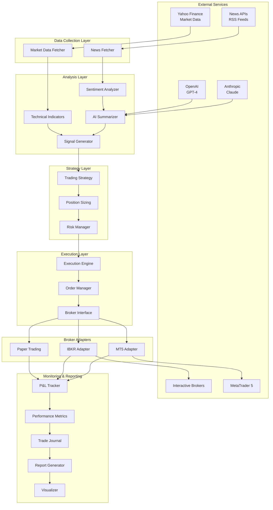
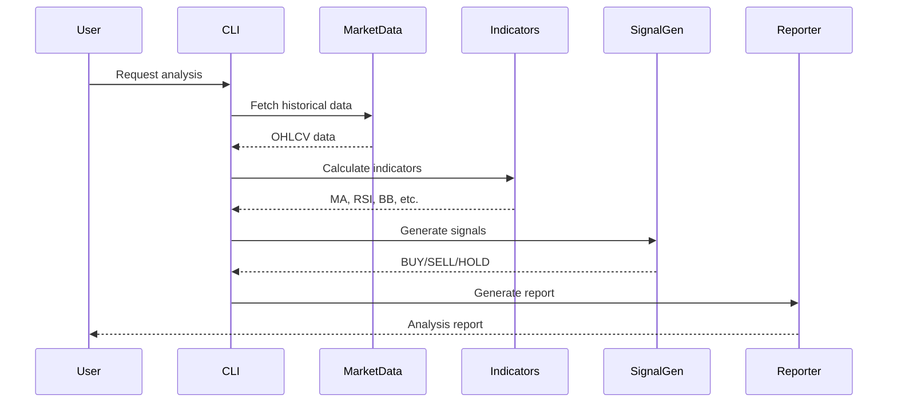
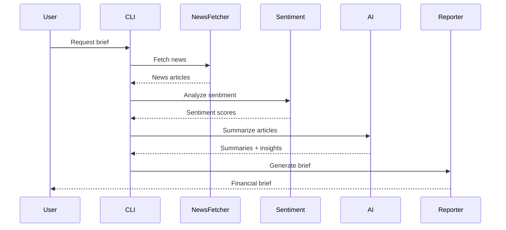
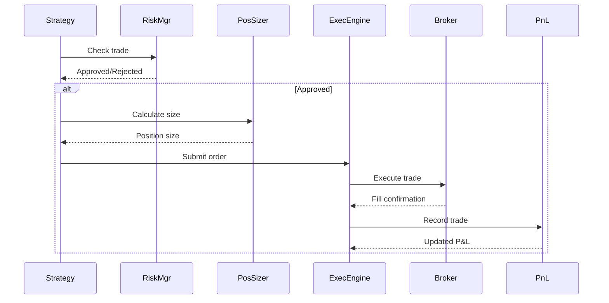
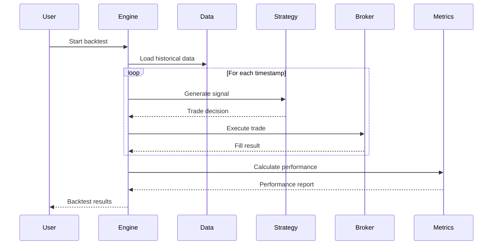

# System Architecture

This document provides a comprehensive overview of the ZenMarket AI system architecture, including design patterns, data flow, and module interactions.

---

## 📐 High-Level Architecture



---

## 🏛️ Architectural Principles

### 1. **Separation of Concerns**
Each module has a single, well-defined responsibility:
- **Data collection** is isolated from analysis
- **Analysis** is independent of execution
- **Execution** is decoupled from specific brokers

### 2. **Dependency Injection**
- Configuration is injected via environment variables
- Brokers are pluggable through abstract interfaces
- AI providers can be swapped (OpenAI ↔ Anthropic)

### 3. **Type Safety**
- Full type hints across all modules
- Pydantic models for data validation
- mypy type checking in CI/CD

### 4. **Testability**
- All external dependencies are mockable
- Hermetic tests with no network calls
- 378 tests with 63.70% coverage

### 5. **Extensibility**
- New indicators can be added easily
- Custom brokers can be implemented
- Strategies are composable

---

## 📦 Module Architecture

### Core Modules

```
src/
├── advisor/          # Trading signals and technical analysis
│   ├── signal_generator.py
│   ├── indicators.py
│   ├── plotter.py
│   └── advisor_report.py
│
├── backtest/         # Backtesting engine
│   ├── backtest_engine.py
│   ├── backtest_broker.py
│   ├── metrics.py
│   └── visualizer.py
│
├── brokers/          # Broker adapters
│   ├── broker_factory.py
│   ├── ibkr_adapter.py
│   └── mt5_adapter.py
│
├── core/             # Core analysis components
│   ├── market_data.py
│   ├── news_fetcher.py
│   ├── sentiment_analyzer.py
│   ├── summarizer.py
│   └── report_generator.py
│
├── execution/        # Trading execution
│   ├── execution_engine.py
│   ├── broker_simulator.py
│   ├── broker_base.py
│   ├── position_sizing.py
│   ├── risk_manager.py
│   ├── order_types.py
│   ├── pnl_tracker.py
│   ├── journal.py
│   └── compliance.py
│
├── utils/            # Utilities
│   ├── config_loader.py
│   ├── logger.py
│   └── date_utils.py
│
├── cli.py            # Command-line interface
└── main.py           # Main entry point
```

---

## 🔄 Data Flow

### 1. Market Analysis Flow



### 2. News Analysis Flow



### 3. Trading Execution Flow



### 4. Backtest Flow



---

## 🧩 Component Interactions

### Advisor Module

```
┌─────────────────────────────────────┐
│        Advisor Module               │
├─────────────────────────────────────┤
│                                     │
│  ┌────────────────┐                │
│  │   Indicators   │◄───────┐       │
│  │   Calculator   │        │       │
│  └────────────────┘        │       │
│          ▼                 │       │
│  ┌────────────────┐   Market Data  │
│  │     Signal     │        │       │
│  │   Generator    │◄───────┘       │
│  └────────────────┘                │
│          ▼                         │
│  ┌────────────────┐                │
│  │    Plotter     │                │
│  │  (Visualizer)  │                │
│  └────────────────┘                │
│          ▼                         │
│  ┌────────────────┐                │
│  │     Report     │                │
│  │   Generator    │                │
│  └────────────────┘                │
│                                     │
└─────────────────────────────────────┘
```

### Execution Module

```
┌──────────────────────────────────────────┐
│         Execution Module                 │
├──────────────────────────────────────────┤
│                                          │
│  ┌────────────────┐                     │
│  │  Risk Manager  │                     │
│  │                │                     │
│  │ • Circuit      │                     │
│  │   Breakers     │                     │
│  │ • Position     │                     │
│  │   Limits       │                     │
│  │ • Drawdown     │                     │
│  │   Protection   │                     │
│  └────────┬───────┘                     │
│           │                             │
│           ▼                             │
│  ┌────────────────┐                     │
│  │ Position Sizer │                     │
│  │                │                     │
│  │ • Fixed        │                     │
│  │ • Kelly        │                     │
│  │ • Percent      │                     │
│  │ • R-multiple   │                     │
│  └────────┬───────┘                     │
│           │                             │
│           ▼                             │
│  ┌────────────────┐                     │
│  │ Execution      │                     │
│  │ Engine         │                     │
│  │                │                     │
│  │ • Order Mgmt   │                     │
│  │ • Fill Logic   │                     │
│  │ • Compliance   │                     │
│  └────────┬───────┘                     │
│           │                             │
│           ▼                             │
│  ┌────────────────────────────────┐    │
│  │     Broker Interface           │    │
│  ├────────────────────────────────┤    │
│  │  Paper  │  IBKR  │    MT5      │    │
│  └────────────────────────────────┘    │
│                                          │
└──────────────────────────────────────────┘
```

---

## 🔐 Security Architecture

### Data Protection

```
┌──────────────────────────────────┐
│      Environment Variables       │
│                                  │
│  • API_KEYS (encrypted)          │
│  • DATABASE_URL (secured)        │
│  • BROKER_CREDENTIALS (vault)    │
└──────────┬───────────────────────┘
           │
           ▼
┌──────────────────────────────────┐
│     Configuration Loader         │
│                                  │
│  • Pydantic Validation           │
│  • Type Checking                 │
│  • Secret Masking                │
└──────────┬───────────────────────┘
           │
           ▼
┌──────────────────────────────────┐
│       Application Layer          │
│                                  │
│  • No hardcoded secrets          │
│  • Minimal logging of sensitive  │
│  • Encrypted at rest             │
└──────────────────────────────────┘
```

### Risk Controls

```
┌─────────────────────────────────────────┐
│         Risk Control Layers             │
├─────────────────────────────────────────┤
│                                         │
│  Layer 1: Pre-Trade Validation         │
│  ┌─────────────────────────────────┐   │
│  │ • Max position size             │   │
│  │ • Account balance check         │   │
│  │ • Margin requirements           │   │
│  └─────────────────────────────────┘   │
│                                         │
│  Layer 2: Execution Controls            │
│  ┌─────────────────────────────────┐   │
│  │ • Order validation              │   │
│  │ • Price limit checks            │   │
│  │ • Duplicate prevention          │   │
│  └─────────────────────────────────┘   │
│                                         │
│  Layer 3: Position Monitoring           │
│  ┌─────────────────────────────────┐   │
│  │ • P&L tracking                  │   │
│  │ • Stop-loss automation          │   │
│  │ • Circuit breakers              │   │
│  └─────────────────────────────────┘   │
│                                         │
│  Layer 4: Account Protection            │
│  ┌─────────────────────────────────┐   │
│  │ • Daily loss limits             │   │
│  │ • Maximum drawdown              │   │
│  │ • Emergency stop                │   │
│  └─────────────────────────────────┘   │
│                                         │
└─────────────────────────────────────────┘
```

---

## 🧪 Testing Architecture

### Test Pyramid

```
         ┌──────────────────┐
        ╱                    ╲
       ╱   Integration (5%)   ╲
      ╱                        ╲
     ├──────────────────────────┤
    ╱                            ╲
   ╱   Component Tests (15%)      ╲
  ╱                                ╲
 ├──────────────────────────────────┤
╱                                    ╲
│      Unit Tests (80%)              │
│                                    │
│  • 378 tests                       │
│  • 100% hermetic                   │
│  • Fast execution                  │
└────────────────────────────────────┘
```

### Mocking Strategy

```python
# External dependencies are mocked at boundaries

┌────────────────────────────────────────┐
│         Application Code               │
├────────────────────────────────────────┤
│                                        │
│  ┌──────────────────────────────────┐ │
│  │   Business Logic (Not Mocked)    │ │
│  └──────────────────────────────────┘ │
│                                        │
│  ┌──────────────────────────────────┐ │
│  │   External Boundary (Mocked)     │ │
│  │                                  │ │
│  │  • yfinance API                  │ │
│  │  • OpenAI API                    │ │
│  │  • Anthropic API                 │ │
│  │  • File I/O                      │ │
│  │  • Network calls                 │ │
│  └──────────────────────────────────┘ │
│                                        │
└────────────────────────────────────────┘
```

---

## 📊 Performance Considerations

### Caching Strategy

- **Market Data**: Cache intraday data for 5 minutes
- **News Articles**: Cache for 1 hour
- **AI Responses**: Cache identical prompts for 24 hours
- **Technical Indicators**: Recalculate only on new data

### Optimization Techniques

1. **Vectorized Operations**: Use pandas/numpy for bulk calculations
2. **Lazy Loading**: Load data only when needed
3. **Batch Processing**: Process multiple symbols in batches
4. **Async I/O**: Parallel news fetching with asyncio
5. **Incremental Updates**: Only calculate new bars

---

## 🔄 Extensibility Points

### 1. Custom Indicators

```python
from src.advisor.indicators import TechnicalIndicators

class CustomIndicators(TechnicalIndicators):
    def calculate_custom_indicator(self, data):
        # Your custom logic
        pass
```

### 2. Custom Brokers

```python
from src.execution.broker_base import BrokerInterface

class CustomBroker(BrokerInterface):
    def connect(self):
        # Connection logic
        pass

    def place_order(self, order):
        # Order execution logic
        pass
```

### 3. Custom Strategies

```python
from src.advisor.signal_generator import SignalGenerator

class CustomStrategy(SignalGenerator):
    def generate_signal(self, data, indicators):
        # Custom signal logic
        pass
```

---

## 📈 Scalability

### Current Limitations

- **Single-threaded**: Main execution loop
- **In-memory**: All data stored in RAM
- **Local**: No distributed processing

### Scaling Options

1. **Horizontal Scaling**:
   - Multiple instances for different symbols
   - Message queue for trade coordination
   - Shared database for state

2. **Vertical Scaling**:
   - Increase server resources
   - Use faster storage (SSD/NVMe)
   - Optimize code paths

3. **Architectural Evolution**:
   - Microservices for each module
   - Event-driven architecture
   - Cloud-native deployment

---

## 🚀 Deployment Architecture

### Development

```
┌────────────────────────┐
│   Developer Machine    │
│                        │
│  • Local Python env    │
│  • SQLite database     │
│  • Mock brokers        │
│  • Debug logging       │
└────────────────────────┘
```

### Production (Recommended)

```
┌─────────────────────────────────────────┐
│            Cloud/VPS Server             │
├─────────────────────────────────────────┤
│                                         │
│  ┌───────────────────────────────────┐ │
│  │     Application Container         │ │
│  │                                   │ │
│  │  • Python 3.11+                   │ │
│  │  • ZenMarket AI                   │ │
│  │  • Environment variables          │ │
│  └───────────────────────────────────┘ │
│                                         │
│  ┌───────────────────────────────────┐ │
│  │        Database                   │ │
│  │                                   │ │
│  │  • PostgreSQL (recommended)       │ │
│  │  • Trade history                  │ │
│  │  • Performance metrics            │ │
│  └───────────────────────────────────┘ │
│                                         │
│  ┌───────────────────────────────────┐ │
│  │      Monitoring & Logging         │ │
│  │                                   │ │
│  │  • Application logs               │ │
│  │  • Performance metrics            │ │
│  │  • Alert system                   │ │
│  └───────────────────────────────────┘ │
│                                         │
└─────────────────────────────────────────┘
```

---

## 🎯 Future Architecture

### Planned Enhancements

1. **Microservices**: Split into independent services
2. **Event Sourcing**: Capture all state changes
3. **CQRS**: Separate read and write models
4. **WebSocket**: Real-time data streaming
5. **GraphQL API**: Flexible data queries
6. **Machine Learning**: Model training pipeline

---

## 📚 Related Documentation

- [Modules Documentation](modules/advisor.md) - Detailed module descriptions
- [Trading Logic](trading-logic/risk_management.md) - Risk management and signals
- [User Guide](user-guide/cli.md) - Using the system

---

## 🔗 References

- [Clean Architecture](https://blog.cleancoder.com/uncle-bob/2012/08/13/the-clean-architecture.html)
- [Domain-Driven Design](https://martinfowler.com/bliki/DomainDrivenDesign.html)
- [Microservices Patterns](https://microservices.io/patterns/)
- [Event-Driven Architecture](https://martinfowler.com/articles/201701-event-driven.html)
