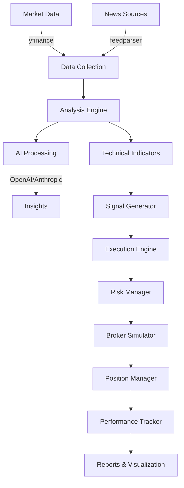

# ZenMarket AI

**AI-powered financial intelligence and market analysis system**

[](https://github.com/TechNatool/zenmarket-ai/actions)
[](https://codecov.io/gh/TechNatool/zenmarket-ai)
[](https://www.python.org/downloads/)
[](https://opensource.org/licenses/MIT)
[](https://github.com/psf/black)

## Overview

ZenMarket AI is a professional-grade financial intelligence system that combines AI-powered analysis with robust trading simulation capabilities. It provides comprehensive market analysis, risk management, and backtesting tools for algorithmic trading research and development.

## Key Features

- **🤖 AI-Powered Analysis**: Integration with OpenAI and Anthropic for intelligent market insights
- **📊 Technical Analysis**: Comprehensive indicators (RSI, MACD, Bollinger Bands, ATR, etc.)
- **💼 Trading Simulator**: Paper trading environment with realistic order execution
- **⚖️ Risk Management**: Position sizing, circuit breakers, and drawdown protection
- **📈 Backtesting**: Comprehensive backtesting with detailed performance metrics
- **📰 Market Intelligence**: Financial news analysis and sentiment scoring
- **🔒 Security**: Built-in safeguards and security best practices

## Architecture



## Quick Start

```bash
# Install
pip install -e ".[dev]"

# Configure
cp .env.example .env
# Edit .env with your API keys

# Run simulator
python -m src.cli simulate --symbol AAPL --strategy conservative

# Run backtest
python -m src.cli backtest --symbol AAPL --start 2024-01-01 --end 2024-12-31
```

## Documentation

- [Installation Guide](getting-started/installation.md)
- [Configuration](getting-started/configuration.md)
- [CLI Usage](user-guide/cli.md)
- [Contributing](CONTRIBUTING.md)

## Development

```bash
# Setup development environment
make setup

# Run quality checks
make precommit

# Run tests
make test

# Generate coverage report
make cov
```

## Security

ZenMarket AI operates in paper trading mode by default. Review the [Security Policy](SECURITY.md) before any production use.

## License

MIT License - see [LICENSE](../LICENSE) for details.

## Support

- 📧 Email: contact@technatool.com
- 🐛 Issues: [GitHub Issues](https://github.com/TechNatool/zenmarket-ai/issues)
- 💬 Discussions: [GitHub Discussions](https://github.com/TechNatool/zenmarket-ai/discussions)
