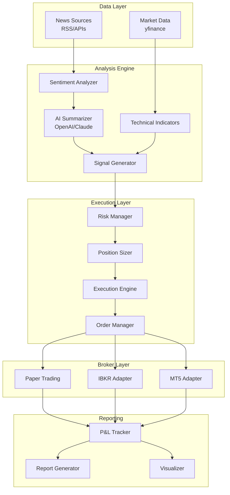

# ZenMarket AI

<div align="center">


**Professional-grade AI-powered financial intelligence and automated trading system**

[](https://github.com/TechNatool/zenmarket-ai/actions)
[](https://codecov.io/gh/TechNatool/zenmarket-ai)
[](https://www.python.org/downloads/)
[](https://opensource.org/licenses/MIT)
[](https://github.com/psf/black)

</div>

---

## Welcome to ZenMarket AI

ZenMarket AI is a **production-ready financial intelligence platform** that combines cutting-edge AI technology with sophisticated trading algorithms to provide actionable market insights. Built with institutional-grade code quality, comprehensive testing, and robust risk management.

!!! success "Current Version: 1.0.0"
    - ✅ **378 passing tests** with 63.70% coverage
    - ✅ **100% hermetic testing** - no external dependencies
    - ✅ **Production-ready** - Black, isort, ruff compliant
    - ✅ **Type-safe** - Full mypy type checking
    - ✅ **Secure** - Bandit security scanning

---

## 🎯 What is ZenMarket AI?

ZenMarket AI is a comprehensive financial analysis and trading system that:

- **Aggregates and analyzes** real-time financial news from multiple sources
- **Performs sentiment analysis** using lexicon-based and AI-powered methods
- **Generates trading signals** based on technical indicators and market conditions
- **Simulates trading strategies** with realistic execution and comprehensive metrics
- **Backtests strategies** against historical data with detailed performance reports
- **Manages risk** with circuit breakers, position limits, and drawdown protection

---

## ✨ Key Features

### 📰 Financial Intelligence Engine
- Multi-source news aggregation (RSS, APIs)
- AI-powered summarization (OpenAI GPT-4, Anthropic Claude)
- Advanced sentiment analysis with confidence scoring
- Market trend detection and categorization
- Daily financial briefings with recommendations

### 📊 Trading Advisor
- **Technical Indicators**: MA20/50, RSI(14), Bollinger Bands, ATR, MACD
- **Signal Generation**: BUY/SELL/HOLD with confidence scores
- **Visual Analytics**: Professional charts with overlay indicators
- **Market Bias**: Aggregate sentiment across multiple assets
- **Customizable**: Configurable thresholds and strategies

### 💼 Trading Execution & Simulation
- **Paper Trading**: Realistic order execution simulator
- **Position Sizing**: Multiple strategies (Fixed, Kelly, Percent, R-multiples)
- **Risk Management**:
    - Circuit breakers for volatility spikes
    - Position size limits
    - Maximum drawdown protection
    - Daily loss limits
- **Order Types**: Market, Limit, Stop-Loss, Take-Profit, Trailing Stop
- **P&L Tracking**: Real-time profit/loss monitoring
- **Trade Journal**: Comprehensive trade logging

### 📈 Backtesting Engine
- Historical data simulation
- Realistic slippage and commission modeling
- Comprehensive performance metrics:
    - Returns: CAGR, Total Return, Monthly/Annual returns
    - Risk-Adjusted: Sharpe, Sortino, Calmar ratios
    - Risk Metrics: Max DD, Volatility, VaR, CVaR
    - Trading Stats: Win rate, Profit factor, Expectancy
- Visual performance reports (PDF, HTML)
- Equity curve and drawdown visualization

### 🔌 Broker Integration
- **Interactive Brokers** (IBKR) adapter
- **MetaTrader 5** (MT5) adapter
- **Paper Trading** simulator (default)
- Extensible broker interface for custom implementations

---

## 🏗️ System Architecture



---

## 🚀 Quick Start

### Installation

```bash
# Clone the repository
git clone https://github.com/TechNatool/zenmarket-ai.git
cd zenmarket-ai

# Install dependencies
pip install -e ".[dev]"

# Configure environment
cp .env.example .env
# Edit .env with your API keys

# Verify installation
pytest
```

### Basic Usage

=== "Financial Brief"

    ```bash
    python -m src.cli brief --symbols AAPL,MSFT,GOOGL
    ```

    Generates a comprehensive daily financial brief with:

    - Latest news and sentiment analysis
    - Market trends and key events
    - AI-generated insights and recommendations

=== "Trading Advisor"

    ```bash
    python -m src.cli advisor --symbol AAPL --period 6mo
    ```

    Generates technical analysis with:

    - Trading signals (BUY/SELL/HOLD)
    - Confidence scores
    - Visual charts with indicators

=== "Trading Simulator"

    ```bash
    python -m src.cli simulate --symbol AAPL --strategy conservative
    ```

    Runs a paper trading simulation with:

    - Realistic order execution
    - Risk management controls
    - Real-time P&L tracking

=== "Backtesting"

    ```bash
    python -m src.cli backtest --symbol AAPL --start 2024-01-01 --end 2024-12-31
    ```

    Backtests a strategy with:

    - Historical performance analysis
    - Comprehensive metrics
    - Visual reports and charts

---

## 📚 Documentation Structure

This documentation is organized into several sections:

### [Architecture](architecture.md)
Deep dive into the system architecture, design patterns, and data flow.

### [User Guide](user-guide/installation.md)
Step-by-step guides for installation, configuration, and using the CLI.

### [Modules](modules/advisor.md)
Detailed documentation for each module in the system.

### [Trading Logic](trading-logic/risk_management.md)
Comprehensive documentation on risk management, signal generation, and performance metrics.

---

## 🎓 Who is ZenMarket AI for?

### 📊 Quantitative Researchers
- Backtest trading strategies with realistic simulation
- Analyze performance metrics and optimize parameters
- Integrate custom indicators and signals

### 💻 Algorithmic Traders
- Build and test automated trading systems
- Implement risk management rules
- Connect to real brokers (IBKR, MT5)

### 📰 Market Analysts
- Monitor financial news and sentiment
- Generate daily market briefs
- Track multiple assets simultaneously

### 🎓 Students & Educators
- Learn financial markets and trading
- Understand technical analysis
- Practice risk management

---

## 🛡️ Production-Ready Quality

### Testing
- **378 passing tests** with comprehensive coverage
- **Unit tests** for all modules
- **Integration tests** for workflows
- **Hermetic tests** - no external dependencies
- **Fast execution** - ~14 seconds for full suite

### Code Quality
- **Black** formatting (100% compliant)
- **isort** import sorting
- **ruff** linting (minimal warnings)
- **mypy** type checking
- **Bandit** security scanning

### CI/CD
- Automated testing on push
- Coverage reporting
- Security audits
- Dependency vulnerability scanning
- Pre-commit hooks

---

## ⚠️ Important Disclaimers

!!! danger "Educational Purpose Only"
    **This software is for educational and research purposes only.**

    - ❌ Not financial advice
    - ❌ Trading involves substantial risk of loss
    - ❌ Past performance ≠ future results
    - ❌ Paper trading ≠ real trading

    **Always consult with licensed financial professionals before making investment decisions.**

!!! warning "Risk Disclosure"
    - Trading financial instruments involves risk
    - You can lose more than your initial investment
    - Leverage amplifies both gains and losses
    - Always use risk management controls
    - Test thoroughly before live trading

---

## 🤝 Contributing

We welcome contributions! See our [Contributing Guide](../CONTRIBUTING.md) for details.

Key areas for contribution:
- New technical indicators
- Additional broker adapters
- Enhanced AI models
- Performance optimizations
- Documentation improvements
- Bug fixes and testing

---

## 📄 License

This project is licensed under the **MIT License** - see the [LICENSE](LICENSE) file for details.

---

## 📧 Support & Contact

- 📧 **Email**: contact@technatool.com
- 🐛 **Issues**: [GitHub Issues](https://github.com/TechNatool/zenmarket-ai/issues)
- 💬 **Discussions**: [GitHub Discussions](https://github.com/TechNatool/zenmarket-ai/discussions)
- 🔒 **Security**: security@technatool.com

---

## 🙏 Acknowledgments

Built with:

- [OpenAI GPT-4](https://openai.com/) - AI-powered analysis
- [Anthropic Claude](https://www.anthropic.com/) - Advanced AI insights
- [yfinance](https://github.com/ranaroussi/yfinance) - Market data
- [pandas](https://pandas.pydata.org/) - Data analysis
- [matplotlib](https://matplotlib.org/) - Visualization
- [pytest](https://pytest.org/) - Testing framework

---

<div align="center">

**Built with ❤️ by TechNatool**

[Get Started](user-guide/installation.md){ .md-button .md-button--primary }
[View on GitHub](https://github.com/TechNatool/zenmarket-ai){ .md-button }

</div>
