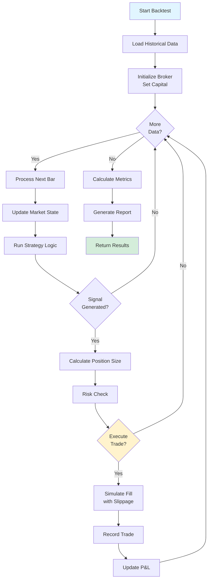

# Backtest Module

The Backtest module provides historical strategy simulation with comprehensive performance analysis.

---

## Overview

Key features:
- Historical data simulation
- Realistic order execution with slippage
- Comprehensive performance metrics
- Visual equity curves and reports
- Statistical analysis

---

## Components

### 1. Backtest Engine (`backtest_engine.py`)

Core engine for running backtests.

#### Features
- Bar-by-bar simulation
- Event-driven architecture
- Custom strategy support
- Progress tracking
- Performance measurement

#### Backtest Workflow



#### Usage

```python
from src.backtest.backtest_engine import BacktestEngine
from src.backtest.backtest_broker import BacktestBroker

broker = BacktestBroker(initial_capital=100000)
engine = BacktestEngine(broker=broker)

results = engine.run(
    symbol="AAPL",
    start_date="2024-01-01",
    end_date="2024-12-31",
    strategy=my_strategy
)
```

---

### 2. Backtest Broker (`backtest_broker.py`)

Simulated broker for backtesting.

#### Realism Features
- Historical bid/ask spread
- Configurable slippage (default 0.05%)
- Commission modeling
- No lookahead bias
- Accurate fill prices

#### Configuration

```python
broker = BacktestBroker(
    initial_capital=100000,
    commission_pct=0.001,  # 0.1%
    slippage_pct=0.0005    # 0.05%
)
```

---

### 3. Performance Metrics (`metrics.py`)

Comprehensive performance calculation.

#### Metrics Calculated

##### Returns
- Total Return %
- CAGR (Compound Annual Growth Rate)
- Monthly/Annual returns

##### Risk-Adjusted Metrics
- Sharpe Ratio (risk-adjusted return)
- Sortino Ratio (downside risk)
- Calmar Ratio (drawdown-adjusted)

##### Risk Metrics
- Maximum Drawdown
- Volatility (annualized)
- Value at Risk (VaR)
- Conditional VaR (CVaR)

##### Trading Statistics
- Number of trades
- Win rate (% profitable)
- Average win / Average loss
- Profit factor
- Expectancy

#### Usage

```python
from src.backtest.metrics import calculate_metrics

metrics = calculate_metrics(
    trades=trade_history,
    equity_curve=equity,
    initial_capital=100000
)

print(f"Sharpe Ratio: {metrics.sharpe_ratio:.2f}")
print(f"Max Drawdown: {metrics.max_drawdown_pct:.2f}%")
print(f"Win Rate: {metrics.win_rate:.2f}%")
```

---

### 4. Visualizer (`visualizer.py`)

Professional backtest visualization.

#### Charts Generated

1. **Equity Curve**: Account value over time
2. **Drawdown Chart**: Drawdowns from peak
3. **Monthly Returns Heatmap**
4. **Trade Distribution**: Win/loss histogram
5. **Rolling Sharpe**: Performance consistency

#### PDF Report

```python
from src.backtest.visualizer import generate_backtest_report

generate_backtest_report(
    results=backtest_results,
    output_path="backtest_report.pdf"
)
```

---

## Running a Backtest

### Step 1: Define Strategy

```python
from src.advisor.signal_generator import SignalGenerator

class MyStrategy:
    def __init__(self):
        self.signal_gen = SignalGenerator()
        
    def generate_signal(self, data):
        # Your strategy logic
        return self.signal_gen.generate_signal(data)
```

### Step 2: Configure Backtest

```python
from src.backtest import BacktestEngine, BacktestBroker

broker = BacktestBroker(
    initial_capital=100000,
    commission_pct=0.001
)

engine = BacktestEngine(broker=broker)
```

### Step 3: Run Backtest

```python
results = engine.run(
    symbol="AAPL",
    start_date="2023-01-01",
    end_date="2023-12-31",
    strategy=MyStrategy()
)
```

### Step 4: Analyze Results

```python
print(f"Total Return: {results.total_return_pct:.2f}%")
print(f"Sharpe Ratio: {results.sharpe_ratio:.2f}")
print(f"Max Drawdown: {results.max_drawdown_pct:.2f}%")
print(f"Win Rate: {results.win_rate:.2f}%")
```

---

## Performance Metrics Explained

### Sharpe Ratio
```
Sharpe = (Return - RiskFreeRate) / Volatility

Interpretation:
> 1.0: Good
> 2.0: Very Good
> 3.0: Excellent
```

### Sortino Ratio
```
Sortino = (Return - RiskFreeRate) / DownsideDeviation

Similar to Sharpe but only penalizes downside volatility
```

### Maximum Drawdown
```
MaxDD = (Peak - Trough) / Peak

Largest peak-to-trough decline
Lower is better
```

### Profit Factor
```
ProfitFactor = GrossProfit / GrossLoss

> 1.0: Profitable
> 1.5: Good
> 2.0: Excellent
```

---

## Best Practices

### 1. Avoid Overfitting

```python
# Split data into training and testing
train_end = "2023-06-30"
test_start = "2023-07-01"

# Optimize on training data only
# Validate on test data
```

### 2. Use Realistic Assumptions

```python
broker = BacktestBroker(
    commission_pct=0.001,  # Real commission
    slippage_pct=0.001,    # Conservative slippage
)
```

### 3. Test Multiple Periods

```python
# Test across different market conditions
periods = [
    ("2020-01-01", "2020-12-31"),  # COVID crash
    ("2021-01-01", "2021-12-31"),  # Bull market
    ("2022-01-01", "2022-12-31"),  # Bear market
]
```

### 4. Walk-Forward Analysis

```python
# Rolling window backtest
for start, end in rolling_windows:
    results = engine.run(symbol, start, end, strategy)
    analyze_results(results)
```

---

## Common Pitfalls

### ❌ Lookahead Bias
Don't use future information:
```python
# WRONG
today_close = data.loc[today, 'close']
tomorrow_close = data.loc[tomorrow, 'close']
if tomorrow_close > today_close:  # You don't know this yet!
    buy()
```

### ❌ Survivorship Bias
Only testing on currently listed stocks

### ❌ Unrealistic Assumptions
- Zero commissions
- Perfect fills
- No slippage
- Infinite liquidity

---

## Testing

Test coverage:
- `tests/backtest/test_backtest_broker.py` - 6 tests
- `tests/backtest/test_visualizer.py` - 17 tests

Coverage: 59-100% across modules
