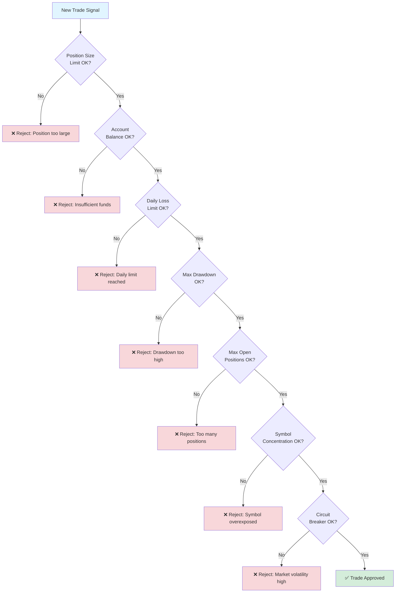

# Risk Management

Comprehensive risk management is critical for successful trading. This document explains ZenMarket AI's risk management system.

---

## Risk Management Layers

```
┌─────────────────────────────────────────┐
│         Risk Management Layers          │
├─────────────────────────────────────────┤
│                                         │
│  Layer 1: Position Sizing               │
│  • Max 2% risk per trade                │
│  • Kelly Criterion support              │
│  • ATR-based sizing                     │
│                                         │
│  Layer 2: Position Limits               │
│  • Max 10% per position                 │
│  • Max 5 concurrent positions           │
│  • Max 20% per symbol                   │
│                                         │
│  Layer 3: Loss Limits                   │
│  • Daily loss limit (5%)                │
│  • Maximum drawdown (10%)               │
│  • Stop-loss automation                 │
│                                         │
│  Layer 4: Circuit Breakers              │
│  • Volatility spikes                    │
│  • Rapid losses                         │
│  • Market conditions                    │
│                                         │
└─────────────────────────────────────────┘
```

### Risk Management Decision Flow



---

## Position Sizing

### Fixed Size

**When to use:** Simple strategies, consistent capital allocation

```python
# Always trade same number of shares
position_size = 100  # shares

# Pros: Simple, predictable
# Cons: Doesn't scale with account size
```

### Percent of Equity

**When to use:** Most strategies, recommended for beginners

```python
# Risk fixed percentage of account
risk_per_trade = 0.02  # 2%
account_value = 100000
entry_price = 150
stop_loss = 145

risk_per_share = entry_price - stop_loss  # $5
position_size = (account_value * risk_per_trade) / risk_per_share
# = $2000 / $5 = 400 shares
```

**Pros:**
- Scales with account
- Controls risk per trade
- Easy to understand

**Cons:**
- Requires stop-loss
- Can be conservative

### Kelly Criterion

**When to use:** Optimizing bet size, experienced traders

```python
# Calculate optimal bet size
win_rate = 0.60  # 60% win rate
avg_win = 500
avg_loss = 300
loss_rate = 0.40

kelly_fraction = (win_rate * avg_win - loss_rate * avg_loss) / avg_win
# = (0.6 * 500 - 0.4 * 300) / 500
# = 0.36 or 36% of capital

# Use fractional Kelly to reduce risk
fractional_kelly = kelly_fraction * 0.5  # Half Kelly = 18%
```

**Pros:**
- Mathematically optimal
- Maximizes long-term growth

**Cons:**
- Assumes accurate win rate
- Can be aggressive
- Requires historical data

### R-Multiple (ATR-based)

**When to use:** Volatile markets, adaptive sizing

```python
# Size based on volatility (ATR)
account_value = 100000
risk_per_trade = 0.02  # 2%
atr = 3.50  # Average True Range
atr_multiplier = 2.0  # Stop at 2x ATR

risk_per_share = atr * atr_multiplier  # $7
position_size = (account_value * risk_per_trade) / risk_per_share
# = $2000 / $7 = 285 shares
```

**Pros:**
- Adapts to volatility
- Natural stop-loss level
- Works across instruments

**Cons:**
- Requires ATR calculation
- More complex

---

## Position Limits

### Maximum Position Size

Limit exposure to any single position:

```python
MAX_POSITION_SIZE = 0.10  # 10% of account

# Example
account_value = 100000
max_position_value = account_value * MAX_POSITION_SIZE  # $10,000
entry_price = 150
max_shares = max_position_value / entry_price  # 66 shares
```

### Maximum Open Positions

Limit total number of concurrent positions:

```python
MAX_OPEN_POSITIONS = 5

# Prevents over-diversification
# Maintains focus and management ability
```

### Concentration Limits

Limit exposure to single symbol across multiple positions:

```python
MAX_SINGLE_SYMBOL_PCT = 0.20  # 20% max per symbol

# Prevents over-concentration
# Reduces idiosyncratic risk
```

---

## Loss Limits

### Daily Loss Limit

Halt trading if daily loss exceeds threshold:

```python
MAX_DAILY_LOSS_PCT = 0.05  # 5%

starting_equity = 100000
current_equity = 95500
daily_loss = starting_equity - current_equity  # $4,500
daily_loss_pct = daily_loss / starting_equity  # 4.5%

if daily_loss_pct >= MAX_DAILY_LOSS_PCT:
    halt_trading()  # Stop for the day
    print("Daily loss limit reached. Halting trading.")
```

**Rationale:**
- Prevents emotional trading
- Limits damage from bad days
- Forces reset and review

### Maximum Drawdown

Halt trading if drawdown from peak exceeds limit:

```python
MAX_DRAWDOWN_PCT = 0.10  # 10%

peak_equity = 105000  # Highest account value
current_equity = 95000
drawdown = peak_equity - current_equity  # $10,000
drawdown_pct = drawdown / peak_equity  # 9.5%

if drawdown_pct >= MAX_DRAWDOWN_PCT:
    halt_trading()  # Stop until reviewed
    print("Max drawdown reached. Review strategy.")
```

**Rationale:**
- Protects capital
- Signals strategy issues
- Prevents catastrophic losses

---

## Stop-Loss Strategies

### Fixed Stop-Loss

```python
entry_price = 150
stop_loss = 145  # Fixed $5 stop
stop_loss_pct = (entry_price - stop_loss) / entry_price  # 3.33%
```

**Pros:** Simple, predictable
**Cons:** Doesn't adapt to volatility

### ATR-Based Stop

```python
entry_price = 150
atr = 3.50
stop_multiplier = 2.0
stop_loss = entry_price - (atr * stop_multiplier)  # $143
```

**Pros:** Adapts to volatility
**Cons:** Can be wide in volatile markets

### Trailing Stop

```python
entry_price = 150
current_price = 155
trail_percent = 0.05  # 5%

# Stop follows price up
stop_loss = current_price * (1 - trail_percent)  # $147.25

# As price rises to $160
stop_loss = 160 * (1 - trail_percent)  # $152
```

**Pros:** Locks in profits, lets winners run
**Cons:** Can get stopped out prematurely

---

## Circuit Breakers

Automatic trading halts triggered by:

### 1. Volatility Spike

```python
VOLATILITY_THRESHOLD = 0.05  # 5%

# Calculate intraday volatility
price_range = (high - low) / open
if price_range > VOLATILITY_THRESHOLD:
    trigger_circuit_breaker("High volatility")
```

### 2. Rapid Consecutive Losses

```python
MAX_CONSECUTIVE_LOSSES = 3

if consecutive_losses >= MAX_CONSECUTIVE_LOSSES:
    trigger_circuit_breaker("Consecutive losses")
```

### 3. Market Conditions

```python
# VIX (fear index) spike
if vix > 30:
    reduce_position_sizes()
    
# Market gap down
if market_open < previous_close * 0.98:  # -2% gap
    halt_new_positions()
```

---

## Risk Metrics to Monitor

### 1. Position Risk

```python
# Risk per position
position_risk = position_size * (entry - stop_loss)

# As percentage of account
position_risk_pct = position_risk / account_value
```

### 2. Portfolio Risk

```python
# Total risk across all positions
total_risk = sum(position.risk for position in positions)

# As percentage of account
portfolio_risk_pct = total_risk / account_value
```

### 3. Correlation Risk

```python
# Check correlation between positions
if correlation(position1, position2) > 0.7:
    print("Warning: High correlation, diversify")
```

---

## Risk/Reward Ratio

Always assess risk/reward before entering:

```python
entry = 150
stop_loss = 145
target = 160

risk = entry - stop_loss  # $5
reward = target - entry  # $10
risk_reward_ratio = reward / risk  # 2:1

MIN_RISK_REWARD = 2.0  # Minimum 2:1
if risk_reward_ratio >= MIN_RISK_REWARD:
    print("Good risk/reward, consider trade")
else:
    print("Poor risk/reward, skip trade")
```

---

## Diversification

### Symbol Diversification

Don't put all eggs in one basket:

```python
# Bad: 100% in AAPL
positions = {"AAPL": 1.0}

# Good: Spread across sectors
positions = {
    "AAPL": 0.20,   # Tech
    "JPM": 0.20,    # Finance
    "JNJ": 0.20,    # Healthcare
    "XOM": 0.20,    # Energy
    "WMT": 0.20     # Consumer
}
```

### Strategy Diversification

Use multiple uncorrelated strategies:

```python
strategies = {
    "mean_reversion": 0.30,
    "trend_following": 0.30,
    "breakout": 0.20,
    "earnings_momentum": 0.20
}
```

---

## Risk Management Checklist

Before every trade:

- [ ] Position size within limits?
- [ ] Stop-loss defined?
- [ ] Risk/reward ratio > 2:1?
- [ ] Daily loss limit not exceeded?
- [ ] Max positions not reached?
- [ ] No high correlation with existing positions?
- [ ] Circuit breakers not triggered?
- [ ] Sufficient capital for position?

---

## Example: Complete Risk Assessment

```python
# Account
account_value = 100000
peak_equity = 105000
daily_starting_equity = 102000

# Trade parameters
symbol = "AAPL"
entry = 150
stop_loss = 145
target = 160
risk_per_trade = 0.02

# 1. Check drawdown
current_dd = (peak_equity - account_value) / peak_equity
if current_dd >= 0.10:
    print("❌ Max drawdown exceeded")
    exit()

# 2. Check daily loss
daily_loss = (daily_starting_equity - account_value) / daily_starting_equity
if daily_loss >= 0.05:
    print("❌ Daily loss limit exceeded")
    exit()

# 3. Calculate position size
risk_per_share = entry - stop_loss
position_size = (account_value * risk_per_trade) / risk_per_share

# 4. Check position limits
position_value = position_size * entry
position_pct = position_value / account_value
if position_pct > 0.10:
    print("❌ Position too large")
    exit()

# 5. Check risk/reward
risk_reward = (target - entry) / (entry - stop_loss)
if risk_reward < 2.0:
    print("❌ Poor risk/reward")
    exit()

# 6. Check open positions
if len(open_positions) >= 5:
    print("❌ Max positions reached")
    exit()

print("✅ All risk checks passed")
print(f"Position size: {position_size} shares")
print(f"Risk: ${position_size * risk_per_share}")
print(f"Potential reward: ${position_size * (target - entry)}")
```

---

## Best Practices

1. **Never risk more than 2% per trade**
2. **Always use stop-losses**
3. **Maintain diversification**
4. **Monitor drawdowns continuously**
5. **Review and adjust limits regularly**
6. **Keep detailed risk logs**
7. **Test risk rules in simulation first**

---

## Related Documentation

- [Signal Generation Logic](signal_logic.md)
- [Performance Metrics](performance_metrics.md)
- [Execution Module](../modules/execution.md)
